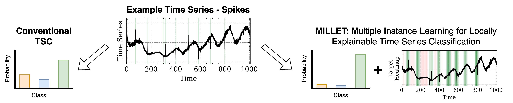

[//]: # ( Copyright Amazon.com, Inc. or its affiliates. All Rights Reserved.)
[//]: # ( SPDX-License-Identifier: Apache-2.0)

# Inherently Interpretable Time Series Classification via Multiple Instance Learning (MILLET)



## Repo Structure

* **data** - Synthetic WebTraffic dataset (time series data and metadata).
* **millet** - Main code implementation for the MILLET framework.
* **model** - Trained model files.
* **notebooks** - Jupyter notebooks demonstrating example usage.

Code is formatted with [Black](https://black.readthedocs.io/en/stable/), [Flake8](https://flake8.pycqa.org/en/latest/),
and [MyPy](https://mypy.readthedocs.io/en/stable/). Maximum line length is set to 120.  
Required libraries can be found in `requirements.txt`.  
For specific versions used in our work (Python 3.8), see `requirements_versioned.txt`.

## Datasets

We provide time series data for our synthetic WebTraffic dataset.  
Train and test time series are stored in csv files, where the first column denotes the class,
and the subsequent 1008 columns denote the timesteps.  
Each row after the header is its own time series, and the time series are indexed by row from 0 to 499.  

In addition to the time series themselves, we provide metadata in JSON files,
e.g. `millet/data/WebTraffic_TRAIN_metadata.json`.  
This metadata contains information on the underlying time series as well as the injected signatures.
We provide a MIL dataset implementation for the WebTraffic dataset in `millet/data/web_traffic_dataset.py`.

UCR datasets are omitted but can be downloaded from https://www.cs.ucr.edu/~eamonn/time_series_data_2018/.  
We provide a MIL dataset implementation for UCR datasets in `millet/data/ucr_2018_dataset.py`.  
See `ucr_dataset_example.ipynb` for more details.

## Notebooks

This repo contains three exemplar notebooks:

* `millet_pipeline.ipynb` - A complete example of dataset loading, model fitting, evaluation, and interpretability
analysis with MILLET.
* `ucr_dataset_example.ipynb` - An example of how to load a UCR dataset.
* `web_traffic_generation_example.ipynb` - Details on how our synthetic WebTraffic dataset is generated.

## Plug and Play Models

In the `millet_pipeline.ipynb` notebook, we show how to construct a MILLET model.  
We give similar code with more comments below:

```python
from millet.model import backbone
from millet.model import pooling
from millet.model.millet_model import MILLETModel
from millet.util import get_gpu_device_for_os

from torch import nn

# Get GPU enabled device depending on operating system
device = get_gpu_device_for_os()

# Univariate dataset so 1 channel
n_channels = 1

# Pooling config
d_in = 128  # Output size of feature extractor
n_clz = 7  # Number of classes in dataset
dropout = 0.1
apply_positional_encoding = True

# Example network class comprised of a feature extractor and pooling method
class ExampleNet(nn.Module):

    def __init__(self, feature_extractor, pool):
        super().__init__()
        self.feature_extractor = feature_extractor
        self.pool = pool

    def forward(self, bags, pos=None):
        timestep_embeddings = self.feature_extractor(bags)
        return self.pool(timestep_embeddings, pos=pos)

# Create network using InceptionTime feature extractor and Conjunctive Pooling
net = ExampleNet(
    backbone.InceptionTimeFeatureExtractor(n_channels),
    pooling.MILConjunctivePooling(d_in, n_clz, dropout=dropout, apply_positional_encoding=apply_positional_encoding)
)

# Wrapper around network for training, evaluation, etc.
model = MILLETModel("ExampleNet", device, n_clz, net)
```

To use an alternative (or custom) feature extractor or pooling method, simply swap the components in `ExampleNet`
with whatever you desire.
Furthermore, additional network features can be added by adapting/extending `ExampleNet`.
In any case, the network should be wrapped with `MILLETModel` to support training/evaluation etc.  

This repo contains implementations for 3 feature extractors: FCN, ResNet, and InceptionTime.
These are contained in `millet/model/backbone/`.

There are also five pooling methods: GAP (EmbeddingSpace MIL), Instance MIL, Attention MIL, Additive MIL, 
and Conjunctive MIL. These are contained in `millet/model/pooling.py`.
